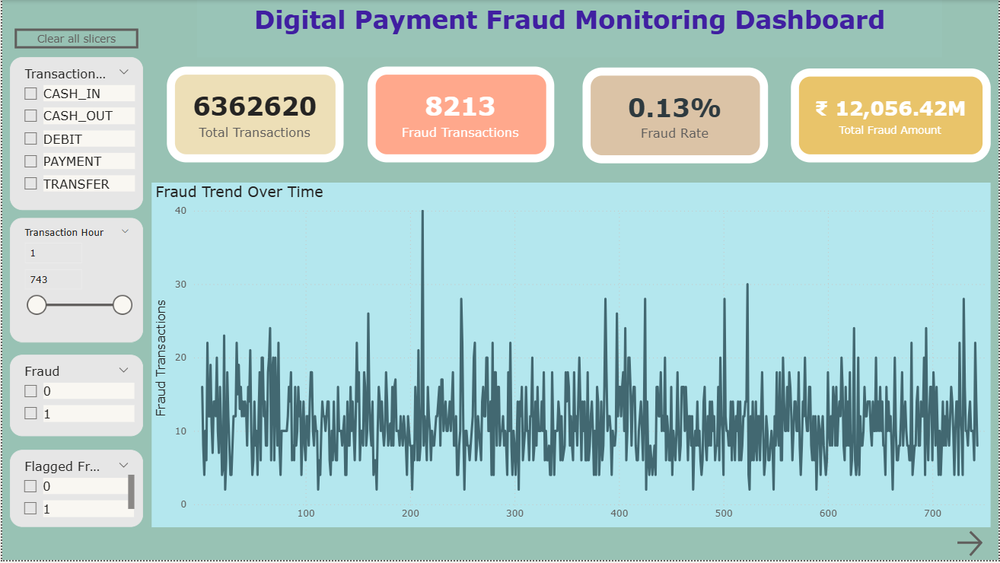
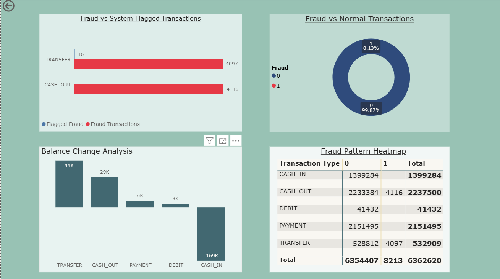

# 💳 Digital Payment Fraud Monitoring Dashboard

---

## 📌 Project Overview

Digital payment systems handle millions of transactions daily. While these systems improve convenience and efficiency, they also increase the risk of fraudulent activities.

This project analyzes online payment transactions and detects fraud patterns using **Power BI**. By transforming raw transaction data into an **interactive analytical dashboard**, the project helps visualize fraud trends, identify high-risk transaction types, and monitor suspicious financial activities.

---

## 🎯 Project Objectives

- Analyze digital payment transactions to identify fraudulent behavior
- Visualize fraud patterns using **Power BI dashboards**
- Detect high-risk transaction types
- Provide insights through interactive analytics
- Support fraud monitoring and financial security

---

## 📊 Dataset

**Dataset:** Online Payments Fraud Detection Dataset  
**Source:** Kaggle  

The dataset contains transaction records including payment types, transaction amounts, account balances, and fraud indicators.

### Key Attributes

- Transaction Type
- Transaction Amount
- Sender Balance Before Transaction
- Sender Balance After Transaction
- Receiver Balance Before Transaction
- Receiver Balance After Transaction
- Fraud Indicator

---

## 🛠 Tools & Technologies

| Tool | Purpose |
|-----|--------|
| Power BI | Dashboard and Data Visualization |
| Power Query | Data Cleaning and Transformation |
| DAX | Calculated Columns and Measures |
| GitHub | Project Hosting |

---

## ⚙ System Approach

Data Import → Power Query Transformation → DAX Calculations → Data Modeling → Dashboard Visualization

### Implementation Steps

1. Import dataset into **Power BI Desktop**
2. Clean and transform data using **Power Query**
3. Create calculated columns such as **Fraud Amount** and **Balance Change**
4. Generate key metrics using **DAX**
5. Build an **interactive fraud monitoring dashboard**

---

## 📈 Dashboard Features

The dashboard provides insights through:

- 📊 Total Transactions
- ⚠ Fraud Transactions
- 📉 Fraud Rate
- 💰 Total Fraud Amount
- 📈 Fraud Trend Over Time
- 🔍 Fraud vs Normal Transactions
- 📊 Fraud by Transaction Type
- 📉 Balance Change Analysis
- 🔥 Fraud Pattern Heatmap

### Interactive Filters

Users can explore data using slicers:

- Transaction Type
- Fraud Status
- Transaction Time
- Flagged Fraud Transactions

---

## 🔍 Key Insights

- **Total Transactions:** 6,362,620  
- **Fraud Transactions:** 8,213  
- **Fraud Rate:** 0.13%  

### Observations

- **TRANSFER** and **CASH_OUT** transactions show the highest fraud occurrences.
- Fraud represents a very small portion of transactions, making detection challenging.
- Balance anomalies often indicate suspicious activity.

---

## 📊 Dashboard Preview

Dashboard screenshots:

---

## 📌 Conclusion

The Power BI dashboard successfully converts raw financial transaction data into meaningful analytical insights. The visualization helps identify fraud patterns, high-risk transaction types, and suspicious behaviors.

This project demonstrates how **data analytics and visualization can support fraud monitoring in digital payment systems.**

---

## 📚 References

- Kaggle – Online Payments Fraud Detection Dataset
  (https://www.kaggle.com/datasets/rupakroy/online-payments-fraud-detection-dataset/data)  
- Microsoft Power BI Documentation  (https://learn.microsoft.com/power-bi/)  

---

## 👨‍💻 Author

**Vinay A**
